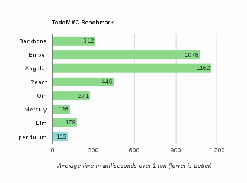

# Readme

# Description

**pendulum** is a language dedicated to the programming of reactive systems on the
 Web. It has a powerful expressivity to describe synchronous concurrent systems
 communicating with broadcasted signals. Its constructions and implementation
 are mostly based on Esterel. The language is embedded in OCaml as a syntax
 extension. It allows the programmer to describe **reactive machines** as OCaml
 values, and run them on signals arguments. The execution of concurrency in pendulum is
 completely sequential and the scheduling is static.
 ([similar work and inspiration](https://github.com/remyzorg/pendulum/wiki/Similar-works-and-inspiration))

The core language is completely compatible with vanilla OCaml compiler.

**We would be grateful for any feedback on this implementation,
but beware that this prototype is still in active developpement**

# Documentation

see a slight [documentation](https://www.github.com/remyzorg/pendulum/wiki/Documentation) and [examples](examples/)


## Examples and benchmark

### Reactive player example

A UI for playing video with customs controls: play/pause, seek, display time

```ocaml
let%sync reactive_player =
  input play_pause; (* the button *)
  input progress_bar; (* the progress element *)
  input media; (* the video element *)
  input time_a; (* the a elt displaying time*)

  let no_update = () in
  let state = Js.to_bool media##.paused in

  (* when the video starts or restarts playing,
     switch the display of the button*)
  loop (
    present media##onplay
      !(play_pause##.textContent := Js.some @@ Js.string "Pause"); pause)

  (* switch state when the button is clicked *)
  || loop (present play_pause##onclick (emit state (not !!state)); pause)

  (* when the state changes, update the media and the button *)
  || loop (present state !(update_state (!!state) media play_pause); pause)

  (* when mouse is down on the progress bar, start emit `no_update` every instants
     until mouse is up to block the following task. When mouse ups,
     update the media in consequence *)
  || loop (
    await progress_bar##onmousedown;
    trap t' (loop (
        emit no_update ();
        present progress_bar##onmouseup
          (!(update_media media progress_bar); exit t');
        pause)
      ); pause)

  (* Each progression steps of the video, update the progress bar
     with the right value. Except if no_update is present. *)
  || loop (
    present media##onprogress (
      present no_update nothing !(update_slider progress_bar media)
      ||
      !(update_time_a media (!!time_a))
    ); pause)
```
see [this example](examples/player) for the full code

### TodoMVC benchmark

Check our [example](examples/todomvc) and the 
[benchmark results](https://github.com/remyzorg/todomvc-perf-comparison)



Details: 
1. Add 100 items
2. Select 100 items (one by one)
3. Remove 100 items (one by one)

The reason why it's so fast, is that adding 100 items runs between two request
animation frames. Ids of items are gathered in signals as lists and 
the instant function just apply the action to all elements of the list
in the following requestAnimationFrame. So it takes only one logical instant
which is basically the execution of a list iterator.

# Install

### with opam (easier)

opam `1.2` with `switch 4.02.2` (minimum) is required

* `opam pin add pendulum git://github.com/remyzorg/pendulum.git`

* an example to use pendulum as syntax extension with ocamlbuild

`ocamlbuild -package pendulum -cflags "-ppx ppx_pendulum" <file-without-ext>.byte`

### without opam

1. `git clone git://github.com/remyzorg/pendulum.git`
2. `cd pendulum`
3. `./configure`
4. `make`
5. `make install `


### Licensing and context

This project is under MIT public license. It started in the context of UCF project.

